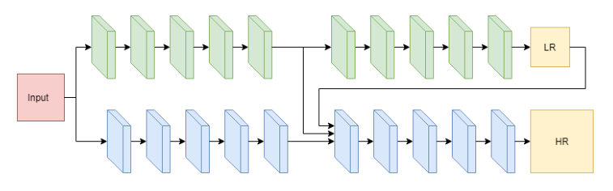

ic-CNN has a two-stage structure and generates a low-resolution heatmap and a high-resolution heatmap as the output of the network. The LR heatmap is 1/4 the radio of the HR heatmap. There are two major blocks in each stage that is similar to the encoder-decoder structure we learned in class. The first block is the downsampling block that captures the patterns/features on the images, and the second block is the upsampling block that is used to generate the heatmap. The LR heatmap also assists the generation of the HR heatmap. In our experiments, the LR heatmap is always training faster than HR heatmap. 

Our loss function is 
$
L(\theta_l, \theta_h) = \frac{1}{n}\sum^n_{i=1}(\lambda_l L(\hat{Z_i}, Z_i) + \lambda_h L(\hat{Y_i}, Y_i) )
$.
It basically compares the LR heatmap with LR ground-truth and the HR heatmap with HR ground-truth. lambda_l and lambda_h are hyperparameters that can be adjusted to change the weights of HR loss and LR loss.

For evaluation, we utilize the metric $(sum(HR) - N_{gt})^2$, where $N_{gt}$ is the ground-truth counting.

Since there are no linear layers in our model, our model can fit any image size for training and evaluation. In addition, ic-CNN does not need to distinguish different head sizes compared to MCNN, making it more suitable for various scenarios. 
