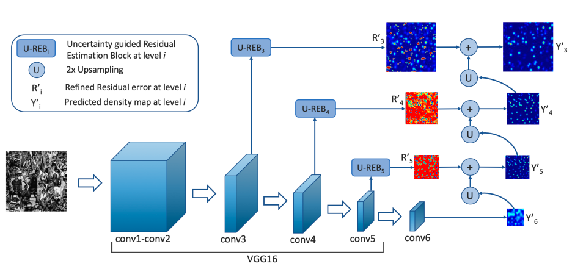
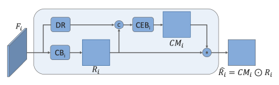

JHU-CROWD++ related work completed by Zachary Fernandes.

### Dataset: JHU-CROWD++

| Dataset     | Resolution        | Num  | Max   | Average | Total   |
|-------------|-------------------|------|-------|---------|---------|
| JHU-CROWD++ | average: 1430x910 | 4372 | 25791 | 346     | 1515005 |

This dataset includes labels for heads that sit beyond the bounds of the image. For the purposes of this assignment, we removed such points so we could perform a fair assessment of the model's capabilities on what heads were present in the image. These images are mostly three-color images taken in various scenarios with different levels of weather and occlusion for scenes and heads respectively. It contains 2272 training images, 500 validation images, and 1600 testing images. Due to vast size of this data, we can undersample from such categories to achieve the distribution we want to feed into our model.

### Model: CG-DRCN

This model comprises of three main components: a VGG-16 backbone, residual learning, and uncertainty-guided residual learning. The original image, of size 256x256, will be downscaled by the VGG-16 layers to 8x8. The next component is the residual learning, which is where the output from the backbone is upscaled and added to a residual generated by an uncertainty-guided residual estimation block, and this occurs until the image is upscaled to 64x64, which is then outputted as the predicted heat map. The residuals are produced by an uncertainty-guided residual estimation block (U-REB), and it predicts the pixel-wise confidence for the residuals, which then gates them before passing them to the next outputs. This is intended to improve the residual learning's efficacy. Theoretically, this model can take any size of input, but this paper used 256x256 croppings of the dataset images to train the model.

Above is the U-REB structure.

The model uses multiple loss functions, the overarching one being L_f = L_d - (lambda_c)L_c. L_d is the pixel-wise regression loss, L_c is the confidence guiding loss, and lambda_c is a regularization constant. Counting performance is measured with Mean Absolute Error and Mean Square Error. When testing, I used a 90%-10% testing-validation split, an Adam optimizer with learning rate = 0.00001, batch sizes of 24 images, and resized images at 512 in the minimum dimension while keeping the aspect ratio.

A repository to the model could not be provided online by the authors or otherwise, with this being my attempt to write it in PyTorch. Overall, the dataset and model were quite complex, and it was a challenge to attempt implementing the CG-DRCN network on my own. Additionally, if I were to train it on the whole dataset with many epochs for learning, I may run into potential issues with Google Colab either running out of memory or the session timing out due to having a free account. Thus, implementing it and ensuring it was capable of learning as intended was was a challenge.

Source: [JHU-CROWD++: Large-Scale Crowd Counting Dataset and A Benchmark Method](http://www.crowd-counting.com/assets/img/jhucrowdv2.pdf)
